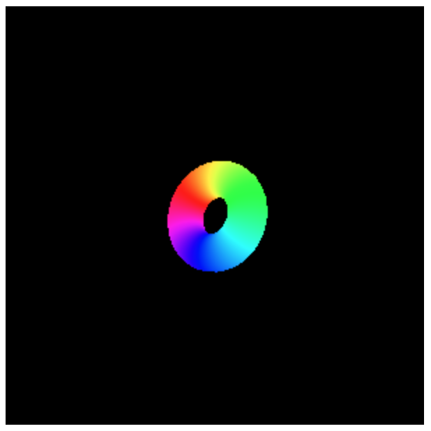

# wgld-webgpu

個人的にWebGPUを学習するリポジトリです。

[wgld.org](https://wgld.org/)のサンプルを参考に、WebGPUでトーラスを描画してみました。



## 使い方

1. 外部パッケージをインストールする。

   ```powershell
   npm install
   ```

2. webサーバを起動する。

   ```powershell
   npm run server
   ```

3. ブラウザで<http://127.0.0.1:8080/>にアクセスする。
